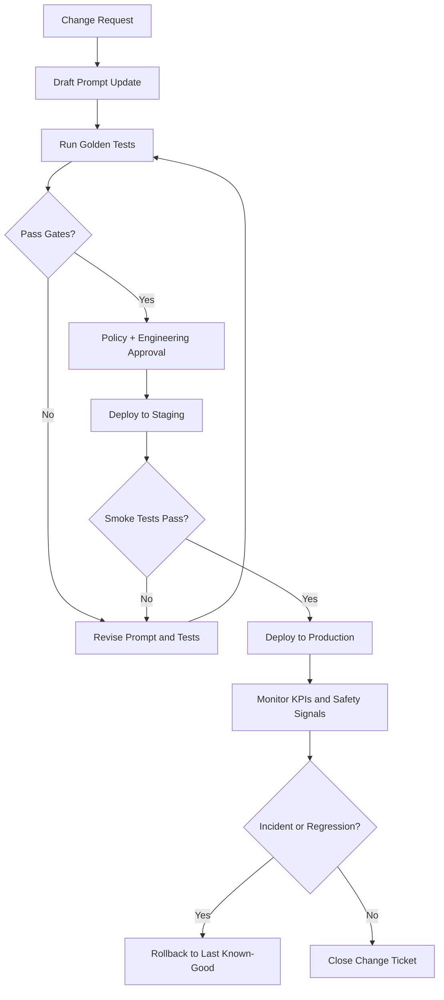

# Prompt Update Process

## Goal
Ship prompt and policy updates safely with traceability, automated checks, human approval, and rollback.

## Workflow Stages
1. **Change Request**
- Source: policy update, moderation feedback, failed golden tests, new feature launch.
- Output: issue ticket with scope, risk level, and owner.

2. **Draft Update**
- Edit `prompt.md` and optionally `test-cases.json` for new behavior.
- Add notes in `PROCESS_LOG.md`.

3. **Automated Validation**
- Run golden tests.
- Validate no regression against baseline thresholds.

4. **Review and Approval**
- Product/Policy reviewer approves safety and moderation behavior.
- Engineering reviewer approves technical consistency.

5. **Deployment**
- Tag prompt version (`vX.Y.Z`) and deploy to staging.
- Run smoke tests.
- Promote to production if pass criteria met.

6. **Monitoring and Rollback**
- Monitor escalation volume, user satisfaction, safety flags.
- Roll back to previous prompt tag if severe degradation is detected.

## Change Approval Rules
- Any change to prohibited-item or safety behavior requires policy approver sign-off.
- Any drop in safety pass rate blocks release.
- Emergency patches can bypass normal schedule but still require post-hoc audit.

## Versioning
- Use semantic versioning:
  - Major: behavior contract changes
  - Minor: new supported scenarios
  - Patch: wording/clarity fixes with no policy change

## Rollback Strategy
- Keep last known-good prompt version in deployment config.
- One-click rollback via CI/CD variable switch.
- Auto-trigger rollback if:
  - P0 safety miss appears in production monitoring
  - Escalation error rate exceeds threshold for 30 minutes

## Diagram

